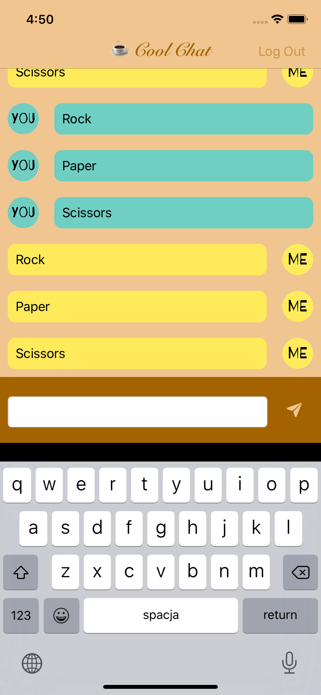

# ☕️ Cool-Chat 
A messenger type application that enables text communication between two iOS devices. 

**App is capable of:** 
- Registering a new user 
- Logging in your existing account 
- Signing out from chat 
- Sending a text message that is saved in cloud FireStore database 
- Reloading chat TableView realtime and sorting messages basing on time interval 
- Working on every iPhone available in portrait & landscape mode 

**This app uses:** 
- MVC 
- AutoLayout 
- UIKit & Foundation 
- FireBase - Cloud Firestore API 
- CocoaPods & Swift Package Manager 

**Screenshots:** 
     
